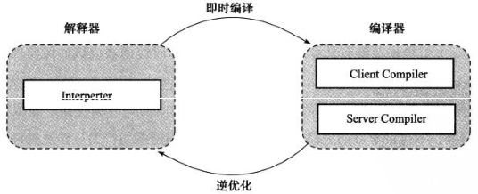
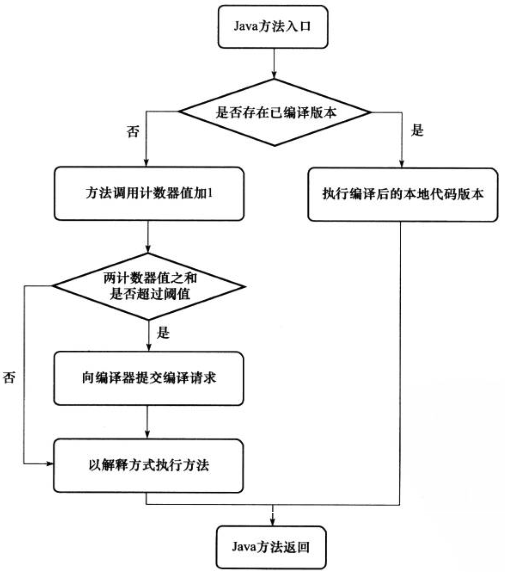

#晚期（运行期）优化

##概述

在部分的商用虚拟机中，java程序最初是通过解释器（Interpreter）进行解释执行的，当虚拟机发现某个方法或代码块的运行特别频繁时，就会把这些代码认定为“热点代码”（Hot Spot Code）。为了提高热点代码的执行效率，在运行时，虚拟机将会把这些代码编译成与本地平台相关的机器码，并进行各种层次的优化，完成这个过程的编译器称为即时编译器（Just In Time Compiler）

java虚拟机规范中没有规定即时编译器应该如何实现，也没有规定虚拟机必需拥有即时编译器，这部分功能完全是虚拟机具体实现相关的内容。本文中提及的编译器、即时编译器都是指HotSpot虚拟机内的即时编译器

##HotSpot虚拟机内的即时编译器

* 为何HotSpot虚拟机要使用解释器与编译器并存的架构？
* 为何HotSpot虚拟机要实现两个不同的即时编译器？
* 程序何时使用解释器执行？何时使用编译器执行？
* 哪些程序代码会被编译为本地代码？如何编译为本地代码？
* 如何从外部观察即时编译器的编译过程和编译结果？

####解释器和编译器

HotSpot虚拟机采用解释器与编译器并存的架构，解释器与编译器两者各有优势：

1. 当程序需要迅速启动和执行的时候，解释器可以首先发挥作用，省去编译的时间，立即执行
2. 在程序运行后，随着时间的推移，编译器逐渐发挥作用，把越来越多的代码编译成本地代码之后，可以获得更高的执行效率
3. 当程序运行环境中内存资源限制较大，可以使用解释执行节约内存，反之可以使用编译执行来提升效率
4. 解释器还可以作为编译器激进优化的一个“逃生门”，让编译器根据概率选择一些大多数时候都能提升运行速度的优化手段，当激进优化的假设不成立时，可以通过逆优化退回到解释状态继续执行

HotSpot虚拟机中内置了两个即时编译器，分别称为Client Compiler和Server Compiler，或者简称为C1编译器和C2编译器，虚拟机默认采用解释器与其中一个编译器直接配合的方式工作。

由于即时编译器编译本地代码需要占用程序运行时间，要编译出优化程度更高的代码，所花费的时间可能更长；而且想要编译出优化程度更高的代码，解释器可能还要替编译器收集性能监控信息，这对解释执行的速度也有影响。HotSpot虚拟机采用分层编译（Tiered Compilation）的策略，其中包括：

* 第0层：程序解释执行，解释器不开启性能监控功能（Profiling），可触发第1层编译
* 第1层：也称为C1编译，将字节码编译为本地代码，进行简单、可靠的优化，如有必要将加入性能监控的逻辑
* 第2层：也称为C2编译，也是将字节码编译为本地代码，但是会启用一些编译耗时较长的优化，甚至会根据性能监控信息进行一些不可靠的激进优化

####编译对象与触发条件

在运行过程中会被即时编译器编译的“热点代码”有两类：

* 被多次调用的方法
* 被多次执行的循环体

在这两种情况下，都是以整个方法作为编译对象，这种编译方式被称为栈上替换（On Stack Replacement，简称OSR编译，即方法栈帧还在栈上，方法就被替换了）

判断一段代码是不是热点代码，是不是需要触发即时编译，这样的行为称为热点探测（Hot Spot Detection），目前主要的热点探测判定方式有两种：

* 基于采样的热点探测（Sample Based Hot Spot Detection）：采用这种方法的虚拟机会周期性地检查各个线程地栈顶，如果发现某个方法经常出现在栈顶，那这个方法就是“热点方法”
  * 优点：实现简单、高效，还可以很容易地获取方法调用关系
  * 缺点：很难精确地确认一个方法的热度，容易因为受到线程阻塞或别的外界因素的影响而扰乱热点探测
* 基于计数器的热点探测（Counter Based Hot Spot Detection）：采用这个种方法的虚拟机会为每个方法建立计数器，统计方法的执行次数，如果执行次数超过一定的阈值就认为它是“热点方法”
  * 优点：统计结果相对来说更加精确和严谨
  * 缺点：实现复杂

在HotSpot虚拟机中使用的是第二种，因此它为每个方法准备了两类计数器：方法调用计数器（Invocation Counter）和回边计数器（Back Edge Counter）。在确定虚拟机运行参数的前提下，这两个计数器都由一个确定的阈值，当计数器超过阈值溢出了，就会触发JIT编译

* 方法调用计数器：用于统计方法被调用的次数，它的默认阈值在Client模式下是1500次，在Server模式在是10000次，可通过-XX: CompileThreshold来设定
  * 方法被调用时，先检查该方法是否存在被JIT编译过的版本
    * 存在：优先使用编译后的本地代码来执行
    * 不存在：将此方法的调用计数器值加1，执行下一步
  * 判断方法调用计数器与汇编计数器值之和是否超过方法调用计数器的阈值
    * 超过阈值：向即时编译器提交一个该方法的代码编译请求。默认不会同步等待编译请求完成，而是继续解释执行，当编译工作完成之后，这个方法的调用入口地址就会被系统自动改写成新的，下一次调用该方法时就会使用已编译版本
    * 未超过：解释执行
  * 如果不做任何设置，方法调用计数器统计的不是方法被调用的绝对次数，而是一个相对执行频率，即一段时间之内方法被调用的次数。当超过一定的时间限度，如果方法的调用次数仍然不足以让它提交给即时编译器编译，那这个方法的调用计数器就会被减少一般，这个过程称为方法调用计数器热度的衰减（Counter Decay）

* 回边计数器：

####编译过程

####查看及分析即时编译结果

##编译优化技术

####优化技术概览

####公共子表达式消除

####数组边界检查消除

####方法内联

####逃逸分析

##java与C/C++的编译器对比
