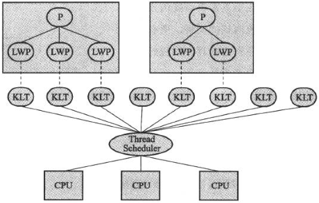
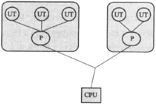
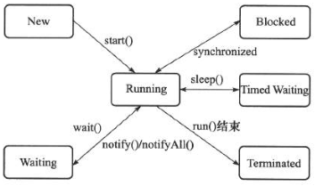

#java内存模型与线程

并发处理的广泛应用是使得Amdahl定律代替摩尔定律成为计算机性能发展源动力的根本原因，也是人类“压榨”计算机运算能力的最有力武器

##硬件的效率与一致性

物理机中为了提升效率而采取的方案：

* 在处理器与内存之间加入一层或多层读写速度尽可能接近处理器运算速度的高速缓存。高速缓存在解决处理器与内存的速度矛盾的同时，也带来了缓存一致性（Cache Coherence）的问题。对此，需要各个处理器在访问缓存时遵循一些协议
* 处理器可能会对输入代码进行乱序执行（Out-Of-Order Execution）优化。处理器会在计算之后将乱序执行的结果重组，保证该结果与顺序执行的结果是一致的，但并不保证程序中各个语句计算的先后顺序与输入代码中的顺序一致。与处理器的乱序执行优化类似，java虚拟机的即时编译器中也有类似的指令重排序（Instruction Reorder）优化

##java内存模型

java虚拟机规范中试图定义一种java内存模型来屏蔽掉各种硬件和操作系统的内存访问差异，以实现让java程序在各种平台下都能达到一致的内存防蚊效果

####主内存与工作内存

java内存模型的主要目的是定义程序中各个变量的访问规则，即在虚拟机中将变量存储到内存和从内存中取出变量这样的底层细节

java内存模型规定了所有的变量都存储在主内存（Main Memory）中。每条线程还有自己的工作内存（Working Memory），线程的工作内存中保存了被该线程使用到的变量的主内存副本拷贝，线程堆变量的所有操作都必须在工作内存中进行，而不能直接读写主内存中的变量

这里说的主内存、工作内存与java内存区域中的java堆、栈、方法区等不是同一个层次的内存划分。主内存、工作内存是对硬件的抽象模型；java堆、栈、方法区是对内存区域的细部划分

####内存间交互操作

java内存模型中定义以下8种操作都是原子的、不可再分的（[double和long有些例外](#对于long和double型变量的特殊规则)）

* lock（锁定）：作用于主内存的变量，把一个变量标识为一条线程独占的状态
* unlock（解锁）：作用于主内存变量，把一个处于锁定状态的变量释放出来，释放后的变量才可以被其他线程锁定
* read（读取）：作用于主内存变量，把一个变量的值从主内存传输到线程的工作内存中，以便随后的load动作使用
* load（载入）：作用于工作内存的变量，把一个read操作从主内存中得到的变量值放入工作内存的变量副本中
* use（使用）：作用于工作内存的变量，把工作内存中一个变量的值传递给执行引起，每当虚拟机遇到一个需要使用到变量的值的字节码指令时将会执行这个操作
* assign（赋值）：作用于工作内存的变量，把一个从执行引擎接收到的值赋给工作内存的变量，每当虚拟机遇到一个给变量赋值的字节码指令时执行这个操作
* store（存储）：作用于工作内存的变量，把工作内存中一个变量的值传送到主内存中，以便随后的write操作使用
* write（写入）：作用于主内存的变量，把store操作从工作内存中得到的变量的值放入主内存的变量中

执行8种基本操作时必须满足的规则：

* 不允许read和load、store和write操作之一单独出现 ==> 不允许一个变量从主内存读取了但工作内存不接受，或者从工作内存发起回写了但主内存不接受的情况出现
* 不允许一个线程丢弃它的最近的assign操作 ==> 变量在工作内存中改变之后必须把该变化同步回主内存
* 不允许一个线程无原因地（没有发生过任何assign操作）把数据从线程的工作内存同步回主内存中
* 对一个变量实施use、store操作之前，必须先执行过了assign和load操作 ==> 一个新的变量只能在主内存中“诞生”，不允许在工作内存中直接使用一个未被初始化的变量
* 一个变量在同一个时刻只允许一条线程对其进行lock操作，但lock操作可以被同一条线程重复执行多次，多次执行lock后，只有执行相同次数的unlock操作，变量才会被解锁
* 如果一个变量事先没有被lock操作锁定，那就不允许对它执行unlock操作，也不允许去unlock一个被其他线程锁定住的变量
* 对一个变量执行unlock操作之前，必须先把此变量同步回主内存中

####对于volatile型变量的特殊规则

volatile关键字是java虚拟机提供的最轻量级的同步机制。volatile只能保证对所有线程的可见性，即当一条线程修改了这个变量的值，新值对于其他线程来说时可以立即得知的。但在并发下一样是不安全的，当两个线程先后对一个变量执行use并先后执行store时，后面线程的结果会覆盖前面线程的结果，这是由于java里面的运算并非原子操作

由于volatile变量只能保证可见性，因此只有在符合以下两条规则的运算场景中才能保证并发安全

* 运算结果并不依赖变量的当前值，或者能够确保只有单一的线程修改变量的值
* 变量不需要与其他的状态变量共同参与不变约束

volatile变量能禁止指令重排优化，普通的变量仅仅会保证在该方法的执行过程中所有依赖赋值结果的地方都能获取到正确的结果，而不能保证变量赋值操作的顺序与程序代码中的执行顺序一致

volatile变量的操作规则：

* 在工作内存中，每次使用volatile变量前都必须先从主内存刷新最新的值，用于保证能看见其他线程对volatile变量修改后的值
* 在工作内存中，每次修改volatile变量后都必须立刻同步回主内存中，用于保证其他线程可以看到自己对volatile变量的修改
* volatile变量不会被指令重排序优化，保证代码的执行顺序与程序的程序相同

####对于long和double型变量的特殊规则

java内存模型要求lock、unlock、read、load、assign、use、store、write这8个操作都具有原子性，但是对于64位的数据类型（long和double），虚拟机允许将没有被volatile修饰的64位数据的读写操作划分位两次32位的操作来执行，这就是所谓的long和double的非原子性协定（Nonatomic Treatment of double and long Variables）

####先行发生原则

先行发生是java内存模型中定义的两项操作之间的偏序关系，如果说操作A先行发生于操作B，操作A产生的影响能被操作B观察到，“影响”包括修改了内存中共享变量的值、发送了消息、调用了方法等

java内存模型中有一些“天然的”先行发生关系，这些先行发生关系无需任何同步器协助就已经存在，可以在编码中直接使用

* 程序次序规则（Program Order Rule）：在一个线程内，按照程序代码顺序，书写在前面的操作先行发生于书写在后面的操作
* 管程锁定规则（Monitor Lock Rule）：一个unlock操作先行发生于后面对同一个锁的lock操作
* volatile变量规则（Volatile Variable Rule）：对一个volatile变量的写操作先行发生与后面对这个变量的读操作
* 线程启动规则（Thread Start Rule）：Thread对象的start()方法先行发生于此线程的每一个动作
* 线程终止规则（Thread Termination Rule）：线程中的所有操作都先行发生于对此线程的终止检测
* 线程中断规则（Thread Interruption Rule）：对线程interrut()方法的调用先行发生于被中断线程的代码检测到中断事件的发生
* 对象终结规则（Finalizer Rule）：一个对象的初始化完成先行发生于它的finalize()方法的开始
* 传递性（Transitivity）：如果操作A先行发生于操作B，操作B先行发生于操作C，那就可以得出操作A先行发生于操作C的结论

##java与线程

####线程的实现

线程是比进程更轻量级的调度执行单位，线程的引入，可以把一个进程的资源分配和执行调度分开，各个线程既可以共享进程资源，又可以独立调度。实现线程主要有3种方式：

1. 使用内核线程实现

内核线程（Kernel-level Thread, KLT）是由操作系统内核直接支持的线程，由内核来完成线程切换，内核通过操纵调度器（Scheduler）对线程进行调度，并负责将线程的任务映射到各个处理器上

程序一般不会直接去使用内核线程，而是去使用内核线程的一种高级接口——轻量级进程（Light Weight Process, LWP），轻量级进程就是通常意义上所讲的线程

轻量级进程的局限性：

* 基于内核线程实现，其创建、析构、同步等操作代价相对较高
* 每个轻量级进程都需要一个内核线程的支持，因此一个系统支持轻量级进程的数量是有限的

2. 使用用户线程实现

用户线程（User Thread, UT）是指完全建立在用户空间的线程库上，系统内核不能感知线程存在的实现。用户线程的建立、同步、销毁和调度完全在用户态中完成，不需要内核的帮助

由于用户线程没有系统内核的支援，因此所有的线程操作都需要用户程序自己处理。线程的创建、切换和调度都是需要考虑的为问题，而且由于操作系统只把处理器支援分配到进程，那诸如“阻塞如何处理”、“多处理器系统中如何将线程映射到其他处理器”这类问题解决起来将会异常困难，甚至不可能完成

3. 使用用户线程加轻量级进行混合实现

线程除了依赖内核线程实现和完全由用户线程自己实现之外，还可以将内核线程与用户线程一起使用。在这种混合实现下，用户线程负责创建、切换、析构等操作，轻量级线程负责执行

####状态转换

java语言中定义了5种线程状态，在任意一个时间点，一个线程只能有且只有其中的一种状态，这5种状态分别如下：

* 新建（New）：创建后尚未启动的线程处于这个状态
* 运行（Runable）：Runable包括了操作系统线程状态种的Running和Ready，也就是处于此状态的线程有可能正在执行，也有可能正在等待CPU为它分配执行时间
* 无限期等待（Waiting）：处于这种状态的线程不会被分配CPU执行时间，它们要等待被其他线程显式地唤醒
  * 没有设置Timeout参数的Object.wait()方法
  * 没有设置Timeout参数的Thread.join()方法
  * LockSupport.park()方法
* 限期等待（Timed Waiting）：处于这种状态的线程也不会被分配CPU执行时间，不过无需等待被其他线程显式地唤醒，在一定时间之后它们会有系统自动唤醒
  * Thread.sleep()方法
  * 设置了Timeout参数的Object.wait()方法
  * 设置了Timeout参数的Thread.join()方法
  * LockSupport.parkNanos()方法
  * LockSupport.parkUntil()方法
* 阻塞（Blocked）：线程被阻塞，等待获取一个排他锁
* 结束（Terminated）：线程已经结束执行

