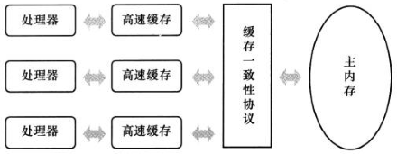
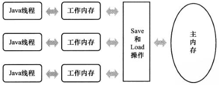

#java内存模型与线程

并发处理的广泛应用是使得Amdahl定律代替摩尔定律成为计算机性能发展源动力的根本原因，也是人类“压榨”计算机运算能力的最有力武器

##硬件的效率与一致性

物理机中为了提升效率而采取的方案：

* 在处理器与内存之间加入一层或多层读写速度尽可能接近处理器运算速度的高速缓存。高速缓存在解决处理器与内存的速度矛盾的同时，也带来了缓存一致性（Cache Coherence）的问题。对此，需要各个处理器在访问缓存时遵循一些协议
* 处理器可能会对输入代码进行乱序执行（Out-Of-Order Execution）优化。处理器会在计算之后将乱序执行的结果重组，保证该结果与顺序执行的结果是一致的，但并不保证程序中各个语句计算的先后顺序与输入代码中的顺序一致。与处理器的乱序执行优化类似，java虚拟机的即时编译器中也有类似的指令重排序（Instruction Reorder）优化

##java内存模型

java虚拟机规范中试图定义一种java内存模型来屏蔽掉各种硬件和操作系统的内存访问差异，以实现让java程序在各种平台下都能达到一致的内存防蚊效果

####主内存与工作内存

java内存模型的主要目的是定义程序中各个变量的访问规则，即在虚拟机中将变量存储到内存和从内存中取出变量这样的底层细节

java内存模型规定了所有的变量都存储在主内存（Main Memory）中。每条线程还有自己的工作内存（Working Memory），线程的工作内存中保存了被该线程使用到的变量的主内存副本拷贝，线程堆变量的所有操作都必须在工作内存中进行，而不能直接读写主内存中的变量

这里说的主内存、工作内存与java内存区域中的java堆、栈、方法区等不是同一个层次的内存划分。主内存、工作内存是对硬件的抽象模型；java堆、栈、方法区是对内存区域的细部划分

####内存间交互操作

java内存模型中定义以下8种操作都是原子的、不可再分的（[double和long有些例外](#对于long和double型变量的特殊规则)）

* lock（锁定）：作用于主内存的变量，把一个变量标识为一条线程独占的状态
* unlock（解锁）：作用于主内存变量，把一个处于锁定状态的变量释放出来，释放后的变量才可以被其他线程锁定
* read（读取）：作用于主内存变量，把一个变量的值从主内存传输到线程的工作内存中，以便随后的load动作使用
* load（载入）：作用于工作内存的变量，把一个read操作从主内存中得到的变量值放入工作内存的变量副本中
* use（使用）：作用于工作内存的变量，把工作内存中一个变量的值传递给执行引起，每当虚拟机遇到一个需要使用到变量的值的字节码指令时将会执行这个操作
* assign（赋值）：作用于工作内存的变量，把一个从执行引擎接收到的值赋给工作内存的变量，每当虚拟机遇到一个给变量赋值的字节码指令时执行这个操作
* store（存储）：作用于工作内存的变量，把工作内存中一个变量的值传送到主内存中，以便随后的write操作使用
* write（写入）：作用于主内存的变量，把store操作从工作内存中得到的变量的值放入主内存的变量中

####对于volatile型变量的特殊规则

####对于long和double型变量的特殊规则

####原子性、可见性与有序性

####先行发生原则

##java与线程

####线程的实现

####java线程调度

####状态转换
