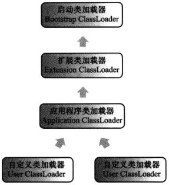

#虚拟机类加载机制

代码编译的结果从本地机械码转变为字节码，是存储格式发展的一小步，却是编程语言发展的一大步

##类加载的时机

类从被加载到虚拟机内存中开始，到卸载出内存为止，它的整个生命周期包括：**加载**（Loading）、**验证**（Verificatio）、**准备**（Preparation）、**解析**（Resolution）、**初始化**（Initialization）、**使用**（Using）和**卸载**（Unloading）7个阶段


上述阶段通常都是**互相交叉地混合式进行**的，会在一个阶段执行地过程中调用、激活另一个阶段。下面5种情况必须立即对类进行“初始化”（加载、验证、准备在这之前开始）：

1. 遇到new、getstatic、putstatic或invokestatic这4条字节码指令
2. 使用java.lang.reflect包地方法对类进行反射调用
3. 初始化子类前要先初始化父类（接口不要求其父接口全部完成初始化，只有在使用父接口的时候才会初始化）
4. 虚拟机启动时，需要指定执行地主类（包含main()方法的类）
5. 当使用JDK 1.7的动态语言支持时，如果一个java.lang.invoke.MethodHandle实例最后解析结果REF_getStatic、REF_putStatic、REF_invokeStatic的方法句柄，并且这个句柄所对应的类没有进行过初始化

##类加载的过程

####加载

在加载阶段，虚拟机需要完成下列3件事：

1. 通过一个类的**全限定名**来获取定义此类的**二进制字节流**
2. 将这个字节流所代表的**静态存储结构**转化为方法区的**运行时数据结构**
3. 在内存中**生成**一个代表这个类的**java.lang.Class对象**，作为方法区这个类的各种数据的**访问入口**

* **非数组类**：可控性最强，加载阶段既可以使用系统提供的引导类加载器，也可以使用自定义的类加载器
* **数组类**：由java虚拟机直接创建，数组类的元素类型（Element Type）最终是靠类加载器去创建
  * 如果数组类的**组件类型**（Component Type，即数组去掉一个维度的类型）是**引用类型**，那就**递归加载**这个组件类型，数组将在加载该组件类型的类加载器的类名称空间上被标识
  * 如果数组的组件类型不是引用类型，java虚拟机将会把数组标记为与引导类加载器关联
  * 数组类的可见性与它的组件类型的**可见性一致**，如果组件类型不是引用类型，那数组类的可见性将默认为public

加载阶段与连接阶段的部分内容（如一部分字节码文件格式验证动作）是交叉进行的，加载阶段尚未完成，连接阶段可能已经开始

####验证

验证是连接阶段的第一步，这一阶段的目的是为了**确保Class文件的字节流**中包含的信息**符合当前虚拟机的要求**，并且**不会危害虚拟机自身的安全**。验证阶段大致上会完成下面4个阶段的检验动作：

1. **文件格式验证**：第一阶段要验证**字节流**是否**符合Class文件格式的规范**，并且**能被当前版本的虚拟机处理**。主要**目的**是保证输入的字节流**能正确解析并存储于方法区内**，格式上符合描述一个java类型信息的要求。这个阶段的验证是基于二进制字节流进行的，只有通过了这个阶段的验证后，字节流才会存储到方法区中，所以后面的3个验证阶段全部是基于方法区的**存储结构**进行的，不会再直接操作字节流
2. **元数据验证**：第二阶段是对字节码描述的信息进行**语义分析**，以保证其描述的信息符合java语言规范的要求。主要目的是对元数据信息进行语义校验，保证不存在不符合java语言规范的元数据信息
3. **字节码验证**：第三阶段是整个验证过程中最复杂的一个阶段，主要目的是通过**数据流**和**控制流**分析，确定程序语义是合法的、符合逻辑的。如果一个类方法体的字节码没有通过字节码验证，那肯定是有问题的；但如果一个方法体通过了字节码验证，也不能说明其一定就是安全的
4. **符号引用验证**：最后一个阶段的验证发生在虚拟机**符号引用转化为直接引用**的时候，这个转化动作将在连接的解析阶段中发生，可以看做是对类自身以外的信息进行匹配性校验。目的是确保解析动作能正常执行

####准备

准备阶段是**正式为类变量分配内存并设置类变量初始值**的阶段，这些变量所使用的内存都将在方法区中进行分配。有两个要点：

* 类变量是指被static修饰的变量，不包括实例变量
* 初始值在通常情况下是数据类型的零值。ConnstantValue属性（final）存在时，变量就会被初始化为ConstantValue属性所指定的值

####解析

解析阶段是虚拟机将常量池内的**符号引用替换为直接引用**的过程

* **符号引用**（Symbolic References）：符号引用以一组符号来描述所引用的目标，符号可以是任何形式的字面量，只要使用是能无歧义地定位到目标即可。符号引用与虚拟机实现的内存布局无关，引用地目标不一定已经加载到内存中。各种虚拟机实现的内存布局可以各不相同，但是它们能接受地符号引用必须是一致的，因为符号引用地字面量形式明确定义在java虚拟机规范地Class文件格式中
* **直接引用**（Direct References）：直接引用可以是直接指向目标的指针、相对偏移量或是一个能直接定位到目标的句柄。直接引用是和虚拟机实现的内存布局相关的，同一个符号引用在不同虚拟机实例上翻译出来的直接引用一般不会相同。如果有了直接引用，那引用的目标必定已经在内存中存在

符号引用更普适，直接引用更迅速。java虚拟机会对除invokedynamic指令外的其它指令的解析结果进行缓存，从而避免解析动作重复进行。如果一个符号引用之前已经被成功解析过，那么后续的引用解析就应当一直成功；如果第一次解析失败，那么其它指令对这个符号的解析也应该收到相同的异常。invokedynamic指令是等到程序实际运行到这条指令的时候，解析动作才能进行

1. **类或接口**的解析
  1. 如果类或接口不是数组类型，那虚拟机将会把代表符号引用的全限定名交给类加载器加载
  2. 如果类或接口是一个数组类型，并且数组的元素类型为对象，就按第1点加载数组元素类型，接着由虚拟机生成一个代表此数组维度和元素的数组对象
  3. 如果上面的步骤没有出现任何异常，还需进行符号引用验证，确认类是否具备对该类或接口的访问权限
2. **字段**解析
  0. 需要先对字段表的class_index项索引的CONSTANT_Class_info符号引用进行解析
  1. 如果类本身就包含了简单名称和字段描述符都与目标相匹配的字段，就返回这个字段的直接引用，查找结束
  2. 如果类实现了接口，就按照继承关系从下往上递归搜索各个接口，匹配到就返回直接引用，查找结束
  3. 如果类不是Object类，就按照继承关系从下往上递归搜索父类，匹配到就返回直接引用，查找结束
  4. 否则，查找失败，抛出java.lang.NoSuchFieldError异常
  5. 如果查找过程成功返回了引用，将会对这个字段进行权限验证，如果发现不具备对字段的访问权限，就抛出java.lang.IllegalAccessError异常
3. **类方法**解析 ==> 实现方法重写
  0. 需要先对方法表的class_index项索引的方法所属的类或接口的符号引用进行解析
  1. 类方法和接口方法符号引用的常量类型定义是分开的，如果类方法表中发现class_index中索引的类是个接口，就抛出java.lang.IncompatibleClassChangeError异常
  2. 如果在类中具有简单名称与描述符匹配的方法，就返回这个方法的直接引用，查找结束
  3. 在类的父类中查找，匹配到就返回方法的直接引用，查找结束
  4. 在类的接口列表及它们的父接口中查找，匹配到说明类是个抽象类，抛出java.lang.AbstractMethodError异常
  5. 否则，方法查找失败，抛出java.lang.NoSuchMethodError异常
  6. 如果查找过程成功返回了引用，将会对这个方法进行权限验证，如果发现不具备此方法的访问权限，就抛出java.lang.IllegalAccessError异常
4. **接口方法**解析
  0. 需要先对接口方法表的class_index项索引的方法所属的类或接口的符号引用进行解析
  1. 如果接口方法表中发现class_index中索引的接口是类，就抛出java.lang.IncompatibleClassChangeError异常
  2. 如果接口中存在简单名称与描述符都匹配的方法，就返回这个方法的直接引用，查找结束
  3. 在接口的父接口中递归查找，匹配到就返回方法的直接引用，查找结束
  4. 否则，查找失败，抛出java.lang.NoSuchMethodError异常

####初始化

类初始化是类加载过程的最后一步，在这个阶段才**真正开始执行类中的字节码**。初始化阶段是执行类构造器```<clinit>()```方法的过程。

* ```<clinit>()```方法与类的构造函数（```<init>()方法```）不同，它**不需要**显式调用父类构造器，**虚拟机会保证**在子类的```<clinit>()```方法执行之前，父类的```<clinit>()```方法已经执行完毕
* 由于父类的```<clinit>()```方法先执行，因此父类中定义的静态语句块要先于子类执行
* ```<clinit>()```方法对于类或接口来说**不是必需**的，如果一个类中没有静态语句块，也没有对变量赋值操作，那么编译器可以不为这个类生成```<clinit>()```方法
* 接口中不能使用静态语句块，但仍然由变量初始化的赋值操作，因此接口与类一样都会生成```<clinit>()```方法，但与类不同的是，执行接口的```<clinit>()```方法不需要先执行父接口的```<clinit>()```方法，只有当父接口中定义的变量使用时，父接口才会初始化。另外，接口的实现类在初始化时也一样不会执行接口的```<clinit>()```方法
* **虚拟机会保证**一个类的```<clinit>()```方法在多线程环境中被**正确地加锁、同步**

##类加载器

####类与类加载器

类加载器虽然只用于实现类的加载动作，但在java程序中起到的作用却远不止类加载阶段。对于任意一个类，都需要由加载它的**类加载器**和这个**类**本身一同**确立其在java虚拟机中的唯一性**，每个类加载器，都拥有一个独立的类命名空间。当一个Class文件被不同的类加载器加载时，加载生成的两个类必定不相等（equals()、isAssignableFrom()、isInstance()、instanceof关键字的结果为false）

####双亲委派机制

从java虚拟机的角度来看，只存在两种不同的类加载器：一种是**启动类加载器**（Bootstrap ClassLoader），这个类加载器使用**c++**实现，是虚拟机的一部分；另一种是**所有其他的类加载器**，这些类加载器都由**java**实现，独立于虚拟机外部，并且全部继承自抽象类java.lang.ClassLoader

从java开发人员的角度看，绝大部分java程序都会使用到以下3中系统提供得加载器：

* **启动类加载器**（Bootstrap ClassLoader）：这个类负责将存放在```<JAVA_HOME>\lib```目录中，或者被-Xbootclasspath参数所指定的路径中的类库加载到虚拟机内存中
* **扩展类加载器**（Extension ClassLoader）：这个加载器由sun.misc.Launcher$ExtClassLoader实现，它负责加载```<JAVA_HOME>\lib\ext```目录中或者被java.ext.dirs系统变量所指定的路径中的所有类库，开发者可以直接使用扩展类加载器
* **应用程序类加载器**（Application ClassLoader）：这个类加载器由sun.misc.Launcher$AppClassLoader实现。由于这个类加载器是ClassLoader中的getSystemClassLoader()方法的返回值，所以一般也称为系统类加载器，负责加载用户类路径（ClassPath）上所指定的类库，开发者可以直接使用这个类加载器



双亲委派模型的工作过程是：如果一个类加载器**收到了类加载的请求**，它首先不会自己去尝试加载这个类，而是把这个请求**委派给父类加载器**去完成，每一个层次的类加载器都是如此，因此所有的加载请求最终都应该传送到顶层的启动类加载器中，只有当**父加载器**反馈自己**无法完成这个加载请求**（它的搜索范围中没有找到所需的类）时，**子加载器**才会尝试自己去**加载**

####双亲委派机制之外

双亲委派模型并**不是一个强制性的约束模型**，而是java设计者推荐给开发者的类加载器实现方式。到目前为止，双亲委派模型主要出现过3次较大规模的“被破坏”情况

1. 第一次是为了jdk1.2**向上兼容**，添加了一个新的findClass()方法
2. 第二次是由于这个模型**本身的缺陷**导致，当基础类需要回调用户代码时，例如JNDI、JDBC、JCE、JAXB、JBI等，为此在Thread类中添加了线程上下文类加载器（Thread Context ClassLoader）
3. 第三次是由于“**热加载**”，即追求即插即用的效果，为此出现了OSGi环境，在这个环境下类加载器发展为网状结构，OSGi的搜索顺序：
  1. 将以java.* 开头的类委派给父类加载器加载
  2. 将委派列表名单内的类委派给父类加载器加载
  3. 将Import列表中的类委派给Export这个类的Bundle的类加载器加载
  4. 查找当前Bundle的ClassPath，使用自己的类加载加载
  5. 查找类是否在自己的Fragment Bundle中，如果在，则委派给Fragment Bundle的类加载器加载
  6. 查找Dynamic Import列表的Bundle，委派给对应的Bundle的类加载器加载
  7. 加载失败
