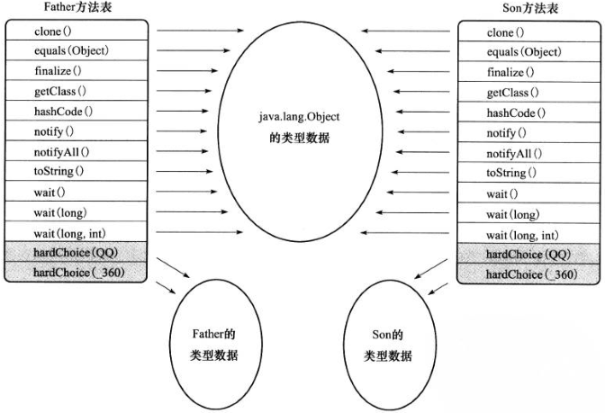
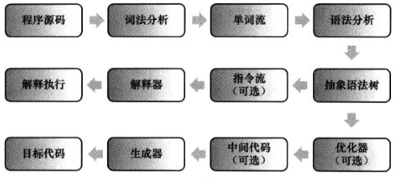

#虚拟机字节码执行引擎

在java虚拟机规范中定制了虚拟机字节码执行引擎的**概念模型**，这个概念模型成为各种虚拟机执行引擎的**统一外观**（Facade）。从外观上看，所有java虚拟机的执行引擎都是一致的：**输入字节码文件，输出执行结果**

##运行时帧栈结构

**栈帧**（Stack Frame）是用于支持虚拟机进行方法调用和方法执行的数据结构，它是虚拟机运行时数据区中的虚拟机栈的栈元素。典型栈帧结构：


####局部变量表

**局部变量表**（Local Variable Table）是一组变量值存储空间，用于存放方法参数和方法内部定义的局部变量。局部变量表的容量以**变量槽**（Variable Slot）为最小单位，虚拟机规范中并**没有**明确指定一个Slot应占用的内存空间大小，只是规定每个Slot都应该能存放一个boolean、byte、char、short、int、float、reference或returnAddress类型的数据，这样可以屏蔽32位跟64位虚拟机在内存空间上的差异。

虚拟机通过**索引定位**的方式使用局部变量表，索引值的范围从0到最大Slot数量，索引n对应第n个Slot。局部变量表中第0位索引的Slot默认是用于传递方法所属对象实例的引用，即this。

为了尽可能的节省栈帧空间，局部变量表中的Slot是**可以重用**的，同时这也影响了垃圾收集行为。即对已使用完毕的变量，局部变量表仍持有该对象的引用，导致对象**无法被GC回收**，占用大量内存。这也是“**不使用的对象应手动赋值为null**”这条推荐编码规则的原因。不过从执行角度使用赋null值的操作来优化内存回收是建立在对字节码执行引擎概念模型的理解之上，代码在经过编译器**优化后才是虚拟机真正需要执行的代码**，这时赋null值会被消除掉，因此**更优雅**的解决办法是以**恰当的变量作用域**来控制变量回收时间。

####操作数栈

**操作数栈**（Operand Stack）也常称操作栈，它是一个后入先出（Last In First Out,LIFO）栈。方法在执行过程中，通过各种字节码指令对栈进行操作，出栈/入栈。java虚拟机的解释执行引擎称为“基于栈的执行引擎”，其中所指的“栈”就是操作数栈

####动态连接

每个栈帧都包含一个指向运行时常量池中该栈帧所属方法的引用，持有这个引用时为了执行方法调用过程中的动态连接（Dynamic Linking）

####方法返回地址

当一个方法开始执行后，只有两种方式可以退出这个方法：

1. 执行引擎遇到任意一个**方法返回的字节码指令**，这个时候可能会有返回值传递给上层的方法调用者（调用当前方法的方法称为调用者），这种退出方式称为**正常完成出口**（Normal Method Invocation Completion）
2. 方法执行过程中遇到了异常，并且这个异常没有在方法体内得到处理，无论是**java虚拟机内部产生**的异常，还是代码使用**athrow字节码指令**产生的异常，只要在本方法的异常表中没有搜索到匹配的异常处理器，就会导致方法退出，这种退出方式称为**异常完成出口**（Abrupt Method Invocation Completion），这时不会给它的上层调用者产生任何返回值

方法退出的过程实际上就等同于把当前栈帧出栈，因此退出时可能执行的操作有：

  * 恢复上层方法的局部变量表和操作数栈
  * 把返回值（如果有）压入调用者栈帧的操作数栈
  * 调整PC计数器的值以指向方法调用指令后面的一条指定等

####附加信息

虚拟机规范允许具体的虚拟机实现增加一些规范里没有描述的信息到栈帧中，称之为栈帧信息

##方法调用

**方法调用并不等同于方法执行**，方法调用阶段的**唯一任务**就是**确定被调用方法的版本**，即调用哪一个方法，暂时还不涉及方法内部的具体运行过程，就是类加载过程中的类方法解析。

####解析

解析就是将Class的常量池中的符号引用转化为直接引用。在java虚拟机中提供了5条方法调用字节码指令：

* **invokestatic**：调用静态方法

  ```
  System.exit(1);
  ==>编译
  iconst_1    ;将1放入栈内
              ;执行System.exit()
  invokestatic java/lang/System/exit(I)V
  ```

* **invokespecial**：调用实例构造器```<init>```方法、私有方法和父类方法

  ```
  //<init>方法
  new StringBuffer()
  ==>编译
  new java/lang/StringBuffer    ;创建一个StringBuffer对象
  dup                           ;将对象弹出栈顶
                                ;执行<init>()来初始化对象
  invokespecial java/lang/StringBuffer/<init>()V

  //父类方法
  super.equals(x);
  ==>编译
  aload_0   ;将this入栈
  aload_1   ;将第一个参数入栈
            ;执行Object的equals()方法
  invokespecial java/lang/Object/equals(Ljava/lang/Object;)Z

  //私有方法
  与父类方法类似
  ```

* **invokevirtual**：调用所有的虚方法

  ```
  X x;
  ...
  x.equals("abc");
  ==>编译
  aload_1   ;将x入栈
  ldc "abc"   ;将“abc”入栈
            ;执行equals()方法
  invokevirtual X/equals(Ljava/lang/Object;)Z
  ```

* **invokeinterface**：调用接口方法，会在运行时再确定一个实现此接口的对象

  ```
  List x;
  ...
  x.toString();
  ==>编译
  aload_1   ;将x入栈
            ;执行toString()方法
  invokeinterface java/util/List/toString()Z
  ```

* **invokedynamic**：先在运行时动态解析出调用点限定符所引用的方法，然后再执行该方法

在编译阶段就可以确定唯一调用版本的方法有：**静态方法（类名）**、**私有方法**、**实例构造器（```<init>```）**、**父类方法(super)**、**final方法**。其它统称为**虚方法**，在编译阶段无法确定调用版本，需要在运行期通过分派将符号引用转变为直接引用

####分派

1. **静态分派**：是指在运行时对类内相同名称的方法根据描述符来确定执行版本的分派，即**方法重载**
2. **动态分派**：是指对于相同方法签名的方法根据实际执行对象来确定执行版本的分派。编译器是根据引用类型来判断方法是否可执行，真正执行的是实际对象方法
3. **单分派与多分派**：方法的接收者与方法的参数统称为方法的**宗量**。单分派是根据根据一个宗量对方法进行选择，多分派是根据多个宗量对方法进行选择
4. **虚拟机动态分派的实现**：由于动态分派是非常频繁的动作，基于性能的考虑，虚拟机中最常用的“稳定优化”手段是为类在方法区中建立一个**虚方法表**（Virtual Method Table，与此对应的，在invokeinterface执行时也会用到接口方法表Interface Method Table），使用虚方法表索引来代替元数据查找以提高性能。除使用方法表外，还可以使用内联缓存（Inline Cache）和基于“类型继承关系分析”（Class Hierarchy Analysis,CHA）技术的守护内联（Guarded Inlining）等



##基于栈的字节码解释执行引擎

####解释执行



* 将上面步骤独立于执行引擎，形成一个**完整**的编译器 ==> C/C++
* 将其中一部分步骤实现为一个**半独立**的编译器 ==> Java
* 将上面步骤和执行引擎全部集中封装在一个封闭的**黑匣子**中 ==> JavaScript（大多数执行器）

####基于栈的指令集与基于寄存器的指令集

* 基于栈的指令集：
  * **优点**：可移植、代码相对更紧凑、编译器实现更简单等
  * **缺点**：执行速度慢、完成相同功能的指令数量更多、栈位于内存中
* 基于寄存器的指令集
  * **优点**：速度快
  * **缺点**：与硬件结合紧密

##参考链接

* [invokestatic](http://cs.au.dk/~mis/dOvs/jvmspec/ref--34.html)
* [invokespecial](http://cs.au.dk/~mis/dOvs/jvmspec/ref--33.html)
* [invokevirtual](http://cs.au.dk/~mis/dOvs/jvmspec/ref--35.html)
* [invokeinterface](http://cs.au.dk/~mis/dOvs/jvmspec/ref--32.html)
