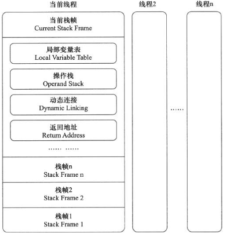

#虚拟机字节码执行引擎

在java虚拟机规范中定制了虚拟机字节码执行引擎的概念模型，这个概念模型成为各种虚拟机执行引擎的统一外观（Facade）。从外观上看，所有java虚拟机的执行引擎都是一致的：输入字节码文件，输出执行结果

##运行时帧栈结构

栈帧（Stack Frame）是用于支持虚拟机进行方法调用和方法执行的数据结构，它是虚拟机运行时数据区中的虚拟机栈的栈元素。典型栈帧结构：

####局部变量表

局部变量表（Local Variable Table）是一组变量值存储空间，用于存放方法参数和方法内部定义的局部变量

####操作数栈

####动态连接

####方法返回地址

####附加信息

##方法调用

####解析

####分派

####动态类型语言支持

##基于栈的字节码解释执行引擎

####解释执行

####基于栈的指令集与基于寄存器的指令集

####基于栈的解释器执行过程
