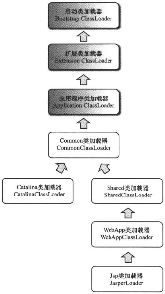

#类加载及执行子系统的案例与实战

##案例分析

####Tomcat：正统的类加载器架构

一个功能健全的web服务器，要解决如下几个问题：

* 部署在同一个服务器上的两个web应用程序所使用的java类库可以实现相互隔离
* 部署在同一服务器上的两个web应用程序所使用的java类库可以互相共享
* 服务器需要尽可能地保证自身的安全不受部署的web应用程序影响
* 支持JSP应用的web服务器，大多数都需要支持HotSwap功能

此时单独一个ClassPath就无法满足需求了，所以各种web服务器都“不约而同”地提供了好几个ClassPath路径供用户存放第三方类库。Tomcat中，/common/、/server/、/shared/和web应用程序自身的/WEB-INF/，一共4组

* /common目录：类库可被Tomcat和所有的web应用程序共同使用
* /server目录：类库可被Tomcat使用，对所有web应用程序都不可见
* /shared目录：类库可被所有的web应用程序共同使用，但对Tomcat自己不可见
* /WebApp/WEB-INF目录：类库仅可以被此web应用程序使用，对Tomcat和其它web应用程序都不可见

####OSGi：灵活的类加载器架构

学习JEE规范，去看JBoss源码；学习类加载器，就去看OSGi源码。OSGi现在已经成为java世界中“事实上”的模块化标准，应用案例如Eclipse IDE

OSGi中的每个模块（称为Bundle）与普通的java类库区别不大，两者一般都以JAR格式进行封装，并且内部存储的都是java package和class。但是一个Bundle可以声明它所依赖的java package（通过Import-Package描述），也可以声明它允许导出发布的java package（通过Export-Package描述）。在OSGi里面，Bundle之间的依赖关系从传统的上层模块依赖底层模块转变为平级模块之间的依赖，而且类库的可见性能得到非常精确的控制，一个模块里只有被Export过的Package才可能由外界访问，其他的Package和class将会隐藏起来。除了更精确的模块划分和可见性控制外，引入OSGi的另外一个重要理由是，基于OSGi的程序很可能可以实现模块级热插拔功能

OSGi的Bundle类加载器之间只有规划，没有固定的委派关系。不涉及某个具体的Package时，各个Bundle加载器都是平级关系，只有具体使用某个Package和Class的时候，才会根据Package导入导出定义来构造Bundle间的委派和依赖

另外，一个Bundle类加载器为其他Bundle提供服务时，会根据Export-Package列表严格控制访问范围。如果一个类存在于Bundle的类库中但是没有被Export，那么这个Bundle的类加载器能找到这个类，但不会提供给其他Bundle使用，而且OSGi平台也不会把其他Bundle的类加载请求分配给这个Bundle来处理

OSGi在提供强大功能的同时，也引入了额外的复杂度，带来了线程死锁和内存泄漏的风险

####字节码生成技术与动态代理的实现

####Retrotranslator：跨越JDK版本

##实战：自己动手实现远程执行功能

####目标

####思路

####实现

####验证
