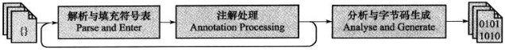

#早期（编译器）优化

##概述

java的编译期可能指的以下三种：

1. 前端编译器：将*.java文件变成*.class文件，例如Sun的Javac、Eclipse JDT中的增量式编译器（ECJ）
2. JIT编译器（Just In Time Compiler）：将字节码变成机器码，例如HotSpot VM的C1、C2编译器
3. AOT编译器（Ahead Of Time Compiler）：直接把*.java文件编译成本地机器码，例如GNU Compiler for the Java（GCJ）、Excelsior JET

本文中涉及到的编译器都仅限于第一类，第二类编译器跟java语言的关系不大。javac这类编译器对代码的运行效率几乎没有任何优化措施，但javac做了许多针对java语言代码过程的优化措施来改善程序员的编码风格和提高编码效率，java许多的语法特性都是靠编译器的语法糖来实现的

##javac编译器

Sun javac编译器的编译过程可以分为3个过程：

* 解析与填充符号表过程
* 插入式注解处理器的注解处理过程
* 分析与字节码生成过程

####解析与填充符号表

解析步骤包括了经典程序编译原理中的词法分析与语法分析两个过程

1. 词法、语法分析
  * 词法分析是将源代码的字符流转变为标记（Token）集合，单个字符是程序编写过程的最小元素，而标记则是编译过程的最小元素，关键字、变量名、字面量、运算符都可以成为标记
  * 语法分析是根据Token序列构造抽象语法树的过程，抽象语法树（Abstract Syntax Tree,AST）是一种用来描述程序代码语法结构的树形表示方式，语法树的每一个节点都代表着程序代码中的一个语法结构（Construct），例如包、类型、修饰符、运算符、接口、返回值甚至代码注释等都可以是一个语法结构
2. 填充符号表
  * 符号表（Symbol Table）是由一组符号地址和符号信息构成的表格，可以想象成K-V的形式。符号表中所登记的信息在编译的不同阶段都要用到。在语义分析中，符号表所登记的内容将用于语义检查和产生中间代码。在目标代码生成阶段，当对符号名进行地址分配时，符号表是地址分配的依据

####注解处理器

注解处理器是用于提供对注解的支持，可以将其看成一组编译器的插件

####语义分析与字节码生成

语法分析后，编译器获得了程序代码的抽象语法树表示，语法树能表示一个结构正确的源程序的抽象，但无法保证源程序是符合逻辑的

1. 标注检查
  * 标注检查检查的内容包括变量使用前是否已被声明、变量与赋值之间的数据类型是否能够匹配等。在标注检查中，还有一个重要的动作称为常量折叠，这使得a=1+2比起a=3不会增加任何运算量
2. 数据及控制流分析
  * 数据及控制流分析是对程序上下文逻辑更进一步的验证，可以检查出诸如程序局部变量在使用前是否赋值、方法的每条路径是否都有返回值、是否所有的受查异常都被正确处理等
3. 解语法糖
  * 语法糖（Syntactic Sugar），也称糖衣语法，指在计算机语言中添加的某种语法，这种语法对语言的功能并没有影响，但方便使用。java在现代编程语言中属于低糖语言，java中的主要语法糖包括泛型、可变参数、自动装箱/拆箱等，虚拟机运行时不支持这些语法，它们在编译阶段还原回简单的基础语法结构，这个过程称为解语法糖
4. 字节码生成
  * 字节码生成阶段不仅仅时把前面各个步骤所生成的信息（语法树、符号表）转化成字节码写到磁盘中，编译器还进行了少量的代码添加和转换工作

##java语法糖的味道

####泛型与类型擦除

泛型的本质时参数化类型（Parametersized Type）的应用，也就是说所操作的数据类型被指定为一个参数

java中的泛型只在程序源码中存在，在编译后的字节码文件中，已经替换为原来的原生类型（Raw Type），并在相应的地方插入了强制转型代码。因此，对于运行期的java语言来说，ArrayList<int>与ArrayList<String>就是同一个类，所以泛型技术实际上时java语言的一种语法糖，java语言中的泛型实现方法称为类型擦除，基于这种方法实现的泛型称为伪泛型

由于java泛型引入的所产生的影响和新的需求，因此，JCP组织对虚拟机规范做出了相应的修改，引入了诸如Signature、LocalVariableTypeTable等新属性用于解决伴随泛型而来的参数类型的识别问题

####自动装箱、拆箱与遍历循环

自动装箱、自动拆箱与遍历循环这些语法糖是java语言里使用得最多的语法糖

####条件编译

条件编译也是java语言的一种语法糖，根据布尔常量值的真假，编译器将会把分支中不成立的代码块消除掉

除了泛型、自动装箱、自动拆箱、循环遍历、可变参数和条件编译外，java语言还有不少其他的语法糖，如内部类、枚举类、断言语句、对枚举和字符串的switch支持、try语句中定义和关闭资源等
