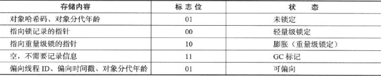
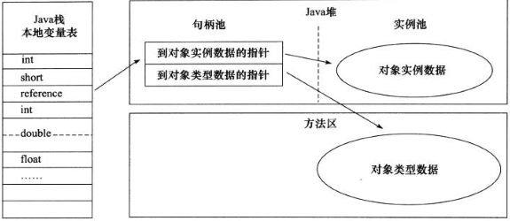
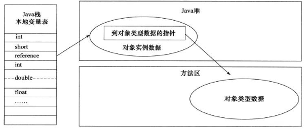

#java内存区域

##运行时数据区域


####程序计数器

程序计数器（Program Counter Register）是一块较小的内存空间，可以看作是当前线程所执行字节码的行号指示器。CPU寄存器？此内存区域是唯一一个在java虚拟机规范中没有规定OutOfMemoryError情况的区域。

####java虚拟机栈

与程序计数器一样，java虚拟机栈（Java Virtual Machine Stacks）也是线程私有的，与线程具有相同生命周期。

虚拟机栈描述的是java方法执行的内存模型：每个方法在执行的同时都会创建一个栈帧（Stack Frame）用于储存**局部变量表、操作数栈、动态链接、方法出口**等信息。每个方法从调用到完成的过程，就对应一个栈帧在虚拟机栈中入栈到出栈的过程。

####本地方法栈

本地方法栈（Native Method Stack）与虚拟机栈所发挥的作用相似，只不过本地方法栈为**Native方法**服务。

####java堆

对大多数应用来说，java堆（Java Heap）是java虚拟机所管理的内存中最大的一块。java堆是被所有线程所共享的一块内存区域，在虚拟机启动时创建，其唯一目的就是存放**对象实例**。

####方法区

方法区（Method Area）与java堆一样，是各个线程共享的内存区域，用于储存**已被虚拟机加载的类信息、常量、静态变量、即时编译器编译后的代码**等数据。目前HotSopt虚拟机已经把字符串常量池从永久代中移出。

####运行时常量池

运行时常量池（Runtime Constant Pool）是方法区的一部分。Class文件中除了有类的版本、字段、方法、接口等描述信息外，还有一项信息是**常量表**（Constant Pool Table），用于存放编译期生成的各种**字面量与符号引用**，这部分内容将在类加载后进入方法区的运行时常量池中存放。

####直接内存

直接内存（Direct Memory）并不是虚拟机运行时数据区的一部分，也不是java虚拟机规范中定义的内存区域。

还记得**NIO**不？NIO操作的就是这部分内存，避免了在java堆和native堆中来回复制数据而提高性能。

直接内存也叫**堆外内存**，不受java堆的大小限制。

##HotSpot虚拟机对象探秘

####对象的创建

虚拟机遇到一条new指令：

1. 检查这个指令的参数是否能在常量池中定位到一个类的符号引用
2. 检查这个符号引用代表的类是否已被加载、解析和初始化过
  * 否：执行相应的类加载过程 [#第7章（TODO）](#TODO)
3. 虚拟机为新生对象分配内存 [#对象的内存布局](#对象的内存布局)
  * 内存空间是绝对规整的，只需要将内存指针向空闲空间移动一段与对象大小相等的距离 ==> **指针碰撞（Bump the Point）**
  * 内存空间不是规整的，需要维护一个列表，查找并更新列表上的记录 ==> **空闲列表（Free List）**
  * 第二种方法不是线程安全的，有两种解决方案
    1. 对分配内存空间的动作进行同步处理 ==> **CAS**
    2. 把内存分配的动作按照线程划分在不同空间中进行，即每个线程在java堆中预先分配一小块内存，称为**本地线程分配缓冲（Thread Local Allocation Buffer,TLAB）**。当需要分配内存时，就在TLAB上分配，只有在TLAB用完需要分配新的TLAB时，才需要同步锁定 ==> **由--XX:+/=UseTLAB决定是否使用**
4. 将分配到的内存空间都初始化为零值（不包括对象头）
5. 对对象进行必要设置，例如这个对象是哪个类的实例、如何才能找到类的元数据信息、对象的哈希码、对象的GC分代年龄等信息，存放在对象的对象头中。
6. 在上面的工作都完成之后，从虚拟机的视角来看，一个新的对象已经产生了，但从java程序的视角来看，对象的创建才刚刚开始。一般来说（由字节码中是否跟随invokspecial指令所决定），执行new指令之后会接着执行**```<init>```方法**，然后一个真正可用的对象才算完全生产出来。

####对象的内存布局

在HotSpot虚拟机中，对象在内存中储存的布局可以分为3块区域：对象头（Header）、实例数据（Instance Data）和对齐填充（Padding）。

* 对象头

HotSpot虚拟机的对象头包括两部分信息：

1. 用于储存对象自身的运行时数据：哈希码（HashCode）、GC分代年龄、锁状态标志、线程持有的锁、偏向线程ID、偏向时间戳等。这部分数据的长度在32位和64位虚拟机（未开启压缩指针）中分别为32bit和64bit，官方称它为“Mark Word”。Mark Word会根据对象的状态复用自己的存储空间。
2. 对象头的另一部分是类型指针，即对象指向它的类元数据的指针，虚拟机通过这个指针来确定这个对象是哪个类的实例。并不是所有的虚拟机实现都必须在对象数据上保留类型指针，换句话说，查找对象的元数据信息并不一定要经过对象本身 [#对象的访问定位](#对象的访问定位) 。如果对象是一个java数组，那在对象头中还必须有一块用于记录数组长度的数据，因为虚拟机可以通过普通java对象的元数据信息确定java对象的大小，但是从数组的元数据中却无法确定数组的大小。



* 实例数据

实例数据部分是对象真正储存的有效信息，也是在程序代码中所定义的各种类型的字段内容，无论是从父类继承下来的，还是在子类中定义的。这部分的储存顺序会受到虚拟机分配策略参数和字段在java源码中的定义顺序的影响。

* 对齐填充

对齐填充不是必然存在的，也没有特别的含义，仅仅起着占位符的作用。

####对象的访问定位

java程序是通过栈上的reference数据来操作堆上的具体对象。目前主流的访问方式有使用句柄和直接指针两种。

* 通过句柄访问

好处：在对象被移动时只会改变句柄中的实例数据指针



* 通过直接指针访问

好处：访问速度快，节省了一次指针定位的时间开销


