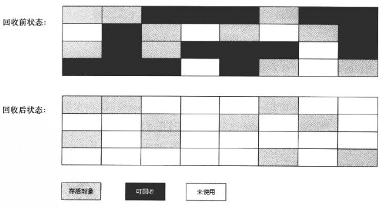
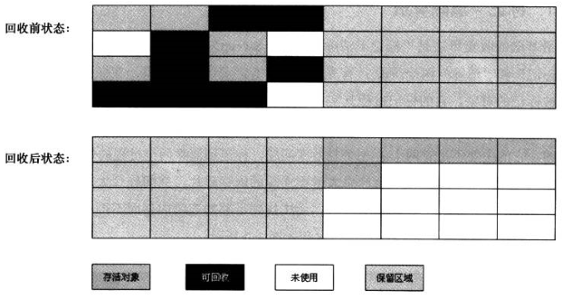
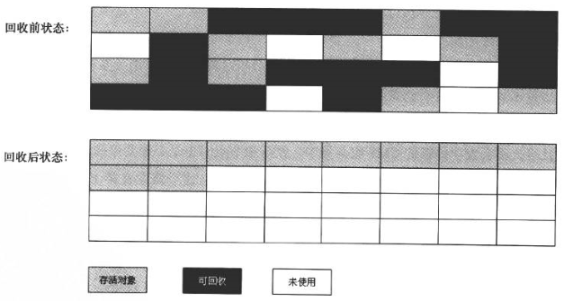
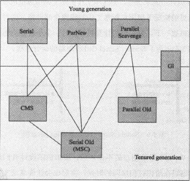

#垃圾收集器与内存分配策略

##如何判断对象已死？

####引用计数算法

在对象中添加一个引用计数器，每当有一个地方引用它时，计数器就加1；当引用失效时，计数器减1；其中计数器为0的对象是不可能再被使用的**已死**对象。

引用计数算法的实现很简单，但有个巨大的缺点，当两个对象**相互引用**时，这两个对象就不会被回收，导致内存泄漏。

####可达性分析算法

通过一系列的称为“GC Roots”的对象作为起始点，从这些节点开始向下搜索，搜索所经过的路径称为引用链（Reference Chain），当一个对象到GC Roots没有任何引用链相连（在图论中称为**对象不可达**）时，这个对象就是不可用的。

在java语言中，可作为GC Roots的对象包括：

* **虚拟机栈**（栈帧中的本地变量表）中引用的对象
* 方法区中**类静态属性**引用的对象
* 方法区中**常量引用**的对象
* 本地方法栈中**JNI**引用的对象

####关于java中的引用

jdk1.2之前，java中的引用指的就是另一块内存的起始地址。

jdk1.2之后，java对引用的概念进行了扩充，将引用分为：

* **强引用**（Strong Reference）：在程序代码中普遍存在，只要强引用还存在，垃圾回收器就不会回收被引用对象 ==> Object obj = new Object();
* **软引用**（Soft Reference）：是用来描述一些还有用但非必须的对象，在系统将要发生OutOfMemoryError时，才会对被引用对象进行回收 ==> SoftReference类
* **弱引用**（Weak Reference）：跟软引用一样也是来描述非必需对象的，但强度更弱，被引用对象只能存活到下次垃圾收集发生之前。无论当前内存是否充足，都会进行回收。 ==> WeakReference类，WeakHashMap类
* **虚引用**（Phantom Reference）：也称为幽灵引用或幻影引用，是最弱的一种引用关系。一个对象是否有虚引用的存在，完全不会对其生存时间构成影响，也无法通过虚引用来取得一个对象实例，唯一的目的就是能在这个对象被收集器回收时收到一个系统通知 WTF？ ==> PhantomReference类

####生存还是死亡

在可达性分析算法中不可达的对象也不是“非死不可”，这个时候它们暂时处于“缓刑”阶段，要真正宣告一个对象死亡，至少需要经历**两次标记**过程。当一个对象被判定为**不可达**时，会先进行**第一次标记**并判断是否需要执行**finalize()方法**。当对象没有覆盖finalize()方法，或finalize()方法已经被调用过，则判定为不需要执行finalize()方法。finalize()方法是对象逃脱死亡命运的最后一次机会，GC会将对象放置在F-Queue队列中，由低优先级的Finalizer线程去执行。虚拟机会触发finalize()方法，但**不保证**会等待它执行结束，因为finalize()方法可能执行缓慢或发生死循环。稍后GC会将F-Queue中的对象进行**第二次标记**，如果对象想要成功救赎自己就需要迅速的将自己与引用链上的任何一个对象建立关联，那么在第二次标记时它将会被移出即将回收的集合。

####回收方法区

很多人认为方法区（HotSopt中的永久代）是没有垃圾收集的，java虚拟机规范中也没有要求需要对方法区实现垃圾收集。

永久代垃圾收集主要回收两部分：

* **废弃常量**

回收废弃常量与回收java堆中的对象非常相似。例如常量池中的“abc”字符串在当前系统中没有被任何一个String对象引用，也没有在其他地方被引用，而且必要的话，这个“abc”常量就会被系统清理出常量池。

* **无用的类**

类需要满足下面3个条件才能算是“无用类”。

  1. 该类的所有实例都已经被回收
  2. 加载该类的ClassLoader已经被回收
  3. 该类对应的Class对象没有在任何地方被引用，即无法通过反射获取该类的方法

虚拟机**可以**对无用类进行回收，但**不是一定会回收**。

##垃圾收集算法

####标记-清除算法

标记-清除算法是**最基础的收集算法**，分为“标记”和“清除”两个阶段：首先标记出所有需要回收的对象，在标记完成后统一回收。之所以所它是最基础的收集算法，是因为后续的收集算法都是基于这个思路并对其不足进行改进而得到的。

主要不足有两个：

* **效率**，标记和清除两个过程的效率都不高。
* **空间**，标记清除后会产生大量不连续的内存碎片，导致以后需要分配较大对象时，无法找到足够的连续内存而不得提前触发垃圾收集动作。

####复制算法

为了解决效率问题，一种称为“复制”的收集算法出现了，它将可用内存分为大小相等的两块，每次只使用其中一块。当这块内存用完了，就将还存活的对象复制到另一块上，然后将已使用过的内存空间一次清理掉。这样就不需要考虑内存碎片等复杂情况，简单高效，是典型的空间换时间，内存消耗太大。

现在的商业虚拟机都采用这种收集算法来**回收新生代**，由于新生代中98%的对象是“朝生夕死”的，所以不需要按照1：1的比例来划分空间，而是把内存分为一块较大的Eden区和两块较小的Survivor区，每次使用Eden和其中一块Survivor。HotSpot虚拟机默认**Eden：Survivor = 8：1**。当然我们无法保证每次回收都只有不多于10%的对象存活，当Survivor空间不足是，需要依赖其他内存（这里是老年代）进行**分配担保**（Handle Promotion），多余的对象会直接通过分配担保进制进入老年代。

####标记-整理算法

复制收集算法在对象存活率较高时就要进行较多的复制操作，效率将会降低，而且还需要额外空间进行分配担保，以应对被使用内存中对象100%存活的极端情况，所以在老年代一般不能直接选择这种算法。标记-整理算法就是根据**老年代**的特点设计的。该算法第一步与标记-清除算法一样，第二步则是将所有存活对象都向一端移动，然后直接清理掉其他内存。

####分代收集算法

目前商业虚拟机垃圾收集都采用“分代收集”（Generational Collection）算法，其原理就是根据对象存活周期的不同将内存划**分为几块**，如新生代和老年代，然后根据各个年代的特点**采用最适当的收集算法**。

##GC算法实现基础

####枚举根节点

在可达性分析中，GC必须先从GC Roots节点找引用链，然后逐个检查里面的引用，可作为GC Roots的节点主要在全局性引用（例如常量或类静态属性）与执行上下文（例如栈帧中的本地变量表）中。另外，可达性分析必须在一个能确保**一致性**的快照中进行，这里的一致性是指在整个分析期间整个系统看起来就像被**冻结**在某个时间点上，不可以出现对象引用关系还在不断变化的情况，该点不满足的话分析结果准确性就无法得到保证。这点是导致GC进行时必须停顿所有java执行线程（**Stop The World**）的其中一个重要原因，即使在号称几乎不会发生停顿的CMS收集器中，枚举根节点时也是必须要停顿的。

####安全点

由于程序在运行时导致引用变化的指令非常多，因此在程序执行时并非在所有地方都能停顿下来开始GC，只有到达特定的位置即安全点（Safepoint）才能暂停。

Safepoint的选定既不能太少以致于让GC等待时间太长，也不能太多以致于过分增大运行时的负荷，还有一个需要考虑的问题就是如何在GC发生时让所有线程都“跑”到最近的安全点上再停顿下来。这里有两种方案可供选择：

* **抢先式中断**（Preemptive Suspension）：不需要线程执行代码主动区配合，在GC发生时，首先把所有线程全部中断，如果发现有线程中断的地方不在安全点上，就恢复线程，让它跑到安全点上。现在几乎没有虚拟机实现采用抢先式中断来暂停线程从而响应GC事件。
* **主动式中断**（Voluntary Suspension）：当GC需要中断线程时，不直接对线程进行操作，仅仅简单地设置一个标志，各个线程执行时主动去轮询这个标志，发现中断标志为真时就自己中断挂起。

####安全区域

对于Safepoint来说，有一个最大的缺点就是需要等待线程走到安全的地方去中断挂起，例如Sleep状态或Blocked状态。这个时候线程无法响应JVM的中断请求，显然JVM也不大可能等待线程重新被分配CPU事件。对于这个情况，就需要安全区域（Safe Region）来解决。安全区域是指在一段代码片段中，引用关系**不会发生变化**，在这个区域的任何地方开始GC都是安全的。当线程执行到Safe Region中的代码时，首先标识自己已经进入了Safe Region，这样，在这段时间内JVM要发起GC时，就不用管标识自己为Safe Region状态的线程了。当线程要离开Safe Region时，要检查系统是否完成了根节点枚举（或者整个GC过程），如果完成则继续执行，否则就必须等待直到可以安全离开Safe Region的信号为止。Safe Region可以看作是Safepoint的扩展。

##垃圾收集器

这里以JDK 1.7 Update 14之后的HotSpot虚拟机为例

图中展示了7中作用与不同分代的收集器，如果两个收集器之间存在连线，就说明它们可以搭配使用。虚拟机所在区域表示它属于新生代收集器还是老年代收集器。

####Serial收集器

####ParNew收集器

####Parallel Scavenge收集器

####Serial Old收集器

####Parallel Old收集器

####CMS收集器

####G1收集器
