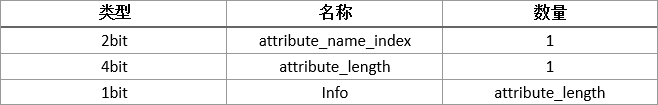

#类文件结构

Java在刚刚诞生之初曾经提出过一个非常著名的口号：“一次编译，导出执行”，将java文件编译为class文件，然后由JVM来处理平台的差异性，这个特性也使其他的语言能够在JVM上运行。

##Class类文件的结构

|占用大小|字段描述|数量|
|---|---|---|
|4bit|magic：魔数，用于标识文件类型，对于java来说是0xCAFEBABE|1|
|2bit|minor_version：次版本号|1|
|2bit|major_version：主版本号|1|
|2bit|constant_pool_count：常量池大小，从1开始而不是0。当这个值为0时，表示后面没有常量|1|
|不定|constant_pool：[#常量池](#常量池)|constant_pool_count-1|
|2bit|access_flags：访问标志，标识这个class是类还是接口、public、abstract、final等|1|
|2bit|this_class：类索引 [#类索引查找全限定名的过程](#类索引查找全限定名的过程)|1|
|2bit|super_class：父类索引|1|
|2bit|interfaces_count：接口计数器|1|
|每个2bit|interfaces：接口索引集合|interfaces_count|
|2bit|fields_count：字段的数量|1|
|不定|fields：[#字段表](#字段表)|fields_count|
|2bit|methods_count：方法数量|1|
|不定|methods：[#方法表](#方法表)|methods_count|
|2bit|attributes_count：属性数量|1|
|不定|attrbutes：[#属性表](#属性表)|attributes_count|

####常量池

主要存放两大类常量：

* **字面量（Literal）**：类似于java的常量
* **符号引用（Symbolic References）**：属于编译原理方面的概念，主要包括类和接口的权限定名（Fully Qualified Name）、字段名称和描述符（Descriptor）、方法名称和描述符。

####类索引查找全限定名的过程

####字段表

字段表集合中不会列出从超类或者父接口中继承而来的字段

* access_flags：**字段标识符**，public、private、protected、static、final、volatile、transient等
* name_index：字段的**简单名称**
* descriptor_index：字段或方法的**描述符**
* attributes_count：属性数量
* attributes：[#属性表](#属性表)

####方法表

####属性表

Class文件、字段表、方法表都可以携带自己的属性表数据集合。与Class文件中其他的数据项目要求严格不同，属性表集合的限制相对宽松。在java虚拟机规范1.7版本中定义了21项属性。

1. Code属性
2. Exceptions属性
3. LineNumberTable属性
4. LocalVariableTable属性
5. SourceFile属性
6. ConstantValue属性
7. innerClasses属性
8. Deprecated及Synthetic属性
9. StackMapTanle属性
10. Signature属性
11. BootstrapMethods属性

##字节码指令简介

####字节码与数据类型

####加载和存储命令

####运算指令

####类型转换指令

####对象创建与访问指令

####操作数栈管理指令

####控制转移指令

####方法调用和返回指令

####异常处理指令

####同步指令

##公有设计和私有实现

##Class文件结构的发展
