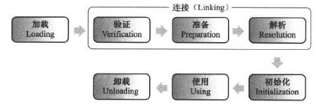

#虚拟机类加载机制

代码编译的结果从本地机械码转变为字节码，是存储格式发展的一小步，却是编程语言发展的一大步

##类加载的时机

类从被加载到虚拟机内存中开始，到卸载出内存为止，它的整个生命周期包括：加载（Loading）、验证（Verificatio）、准备（Preparation）、解析（Resolution）、初始化（Initialization）、使用（Using）和卸载（Unloading）7个阶段

上述阶段通常都是互相交叉地混合式进行的，会在一个阶段执行地过程中调用、激活另一个阶段。下面5种情况必须立即对类进行“初始化”（加载、验证、准备在这之前开始）：

1. 遇到new、getstatic、putstatic或invokestatic这4条字节码指令
2. 使用java.lang.reflect包地方法对类进行反射调用
3. 初始化子类前要先初始化父类（接口不要求其父接口全部完成初始化，只有在使用父接口的时候才会初始化）
4. 虚拟机启动时，需要指定执行地主类（包含main()方法的类）
5. 当使用JDK 1.7的动态语言支持时，如果一个java.lang.invoke.MethodHandle实例最后解析结果REF_getStatic、REF_putStatic、REF_invokeStatic的方法句柄，并且这个句柄所对应的类没有进行过初始化

##类加载的过程

####加载

在加载阶段，虚拟机需要完成下列3件事：

1. 通过一个类的全限定名来获取定义此类的二进制字节流
2. 将这个字节流所代表的静态存储结构转化为方法区的运行时数据结构
3. 在内存中生成一个代表这个类的java.lang.Class对象，作为方法区这个类的各种数据的访问入口

* 非数组类：可控性最强，加载阶段既可以使用系统提供的引导类加载器，也可以使用自定义的类加载器
* 数组类：由java虚拟机直接创建，数组类的元素类型（Element Type）最终是靠类加载器去创建
  * 如果数组类的组件类型（Component Type，即数组去掉一个维度的类型）是引用类型，那就递归加载这个组件类型，数组将在加载该组件类型的类加载器的类名称空间上被标识
  * 如果数组的组件类型不是引用类型，java虚拟机将会把数组标记为与引导类加载器关联
  * 数组类的可见性与它的组件类型的可见性一致，如果组件类型不是引用类型，那数组类的可见性将默认为public

加载阶段与连接阶段的部分内容（如一部分字节码文件格式验证动作）是交叉进行的，加载阶段尚未完成，连接阶段可能已经开始

####验证

验证是连接阶段的第一步，这一阶段的目的是为了确保Class文件的字节流中包含的信息符合当前虚拟机的要求，并且不会危害虚拟机自身的安全。验证阶段大致上会完成下面4个阶段的检验动作：

1. 文件格式验证：第一阶段要验证字节流是否符合Class文件格式的规范，并且能被当前版本的虚拟机处理。主要目的是保证输入的字节流能正确解析并存储于方法区内，格式上符合描述一个java类型信息的要求。这个阶段的验证是基于二进制字节流进行的，只有通过了这个阶段的验证后，字节流才会存储到方法区中，所以后面的3个验证阶段全部是基于方法区的存储结构进行的，不会再直接操作字节流
2. 元数据验证：第二阶段是对字节码描述的信息进行语义分析，以保证其描述的信息符合java语言规范的要求。主要目的是对元数据信息进行语义校验，保证不存在不符合java语言规范的元数据信息
3. 字节码验证：第三阶段是整个验证过程中最复杂的一个阶段，主要目的是通过数据流和控制流分析，确定程序语义是合法的、符合逻辑的。如果一个类方法体的字节码没有通过字节码验证，那肯定是有问题的；但如果一个方法体通过了字节码验证，也不能说明其一定就是安全的
4. 符号引用验证：最后一个阶段的验证发生在虚拟机符号引用转化为直接引用的时候，这个转化动作将在连接的解析阶段中发生，可以看做是对类自身以外的信息进行匹配性校验。目的是确保解析动作能正常执行

####准备

准备阶段是正式为类变量分配内存并设置类变量初始值的阶段，这些变量所使用的内存都将在方法区中进行分配。有两个要点：

* 类变量是指被static修饰的变量，不包括实例变量
* 初始值在通常情况下是数据类型的零值。ConnstantValue属性（final）存在时，变量就会被初始化为ConstantValue属性所指定的值

####解析

1. 类或接口的解析
2. 字段解析
3. 类方法解析
4. 接口方法解析

####初始化

##类加载器

####类与类加载器

####双亲委派机制

####破坏双亲委派机制
